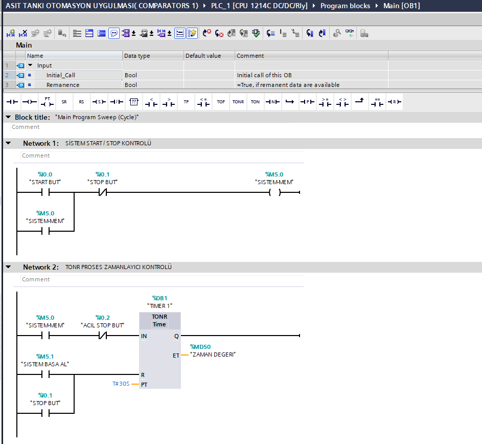
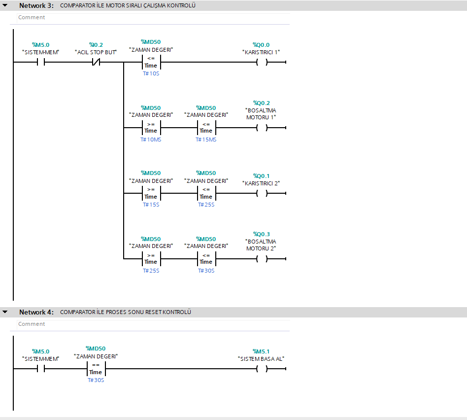
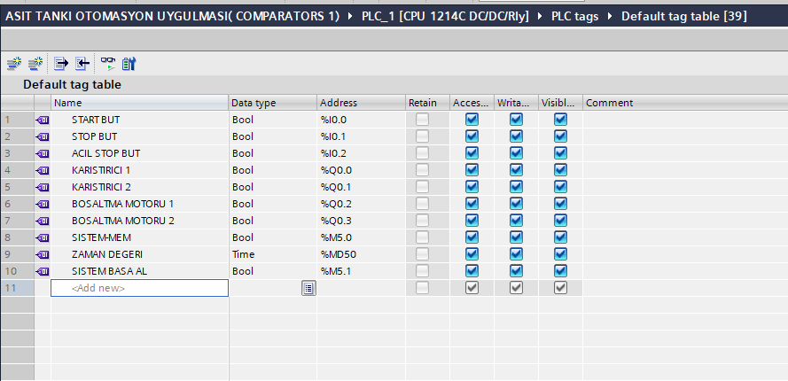
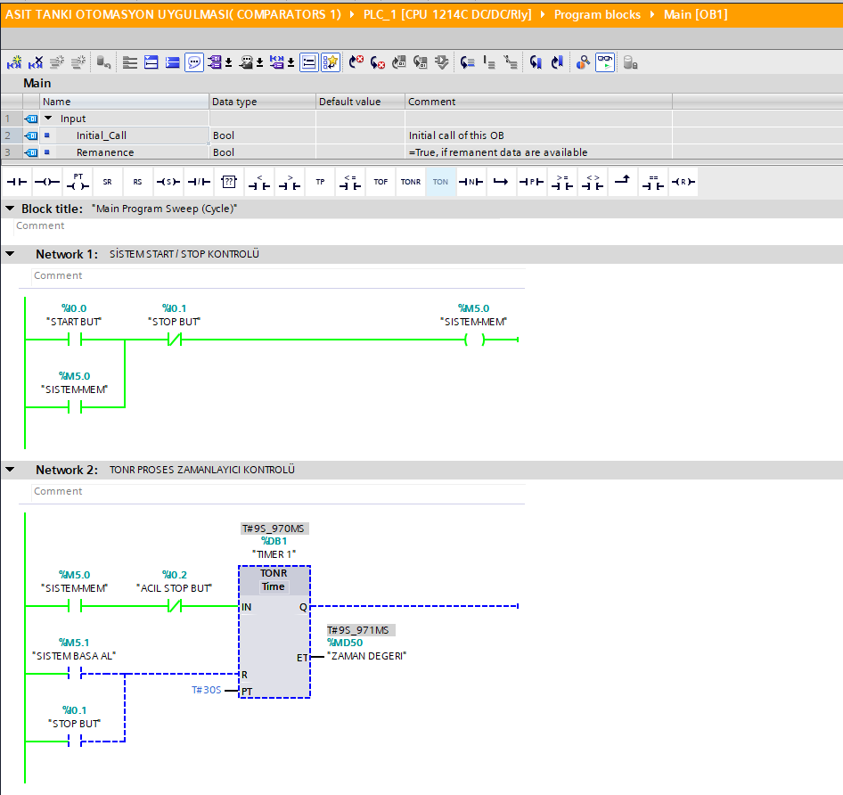
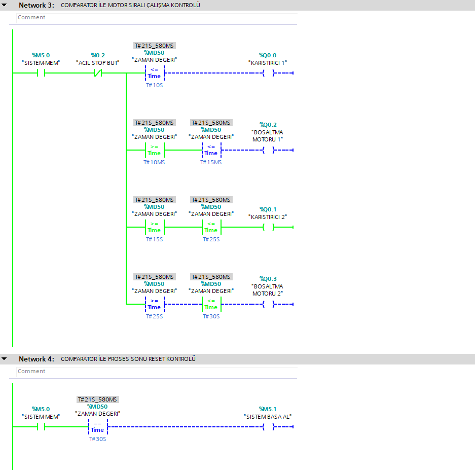

# Asit Tankı Otomasyonu

Bu projede Siemens S7-1200 PLC ve TIA Portal kullanılarak iki tanktan oluşan sıralı bir karıştırma ve boşaltma otomasyonu gerçekleştirilmiştir.

Projenin temel amacı, tek bir **TONR zamanlayıcının geçen süre (ET) değerini karşılaştırma komutları (Comparator)** ile kontrol ederek motorların belirlenen zaman aralıklarında sıralı olarak çalıştırılmasıdır.

## Kullanılan Teknolojiler

- Siemens S7-1200 PLC
- TIA Portal
- Ladder (LAD)
- TONR zamanlayıcı
- Karşılaştırma komutları (`>=`, `<=`, `==`)

## Çalışma Senaryosu

Start butonuna basıldığında sistem devreye girer ve proses aşağıdaki sıraya göre çalışır:

| Zaman Aralığı | Çalışan Ekipman |
|---|---|
| 0 – 10 saniye | Karıştırıcı 1 |
| 10 – 15 saniye | Boşaltma Motoru 1 |
| 15 – 25 saniye | Karıştırıcı 2 |
| 25 – 30 saniye | Boşaltma Motoru 2 |
| 30 saniye | Proses tamamlanır ve sistem başlangıç durumuna döner |

Normal stop butonuna basıldığında sistem durdurulur ve proses başlangıç durumuna döner.

Acil stop aktif olduğunda proses durdurulur. Acil stop kaldırıldığında TONR zamanlayıcının sakladığı süre değeri sayesinde proses kaldığı noktadan devam eder.

## Kontrol Mantığı

Projede motorların çalışma sürelerini kontrol etmek için ayrı ayrı zamanlayıcılar yerine bir adet **TONR zamanlayıcı** kullanılmıştır.

TONR zamanlayıcının `ET` çıkışındaki geçen süre değeri `%MD50` adresinde tutulmakta ve bu değer karşılaştırma komutlarıyla kontrol edilmektedir.

Örneğin:

- `%MD50 <= T#10S` → Karıştırıcı 1
- `%MD50 >= T#10S` ve `%MD50 <= T#15S` → Boşaltma Motoru 1
- `%MD50 >= T#15S` ve `%MD50 <= T#25S` → Karıştırıcı 2
- `%MD50 >= T#25S` ve `%MD50 <= T#30S` → Boşaltma Motoru 2
- `%MD50 == T#30S` → Proses sonu / zamanlayıcı reset

## PLC Programı

### Start / Stop ve TONR Zamanlayıcı Kontrolü

### Comparator ile Motor Kontrolü

## PLC Tag Tablosu

Projede kullanılan giriş, çıkış ve hafıza değişkenleri:

## Online Test

Program TIA Portal üzerinden online olarak izlenerek motorların belirlenen zaman aralıklarında devreye girip çıktığı kontrol edilmiştir.

### TONR Zamanlayıcı Online İzleme

### Comparator Online İzleme

## Proje Dosyası

Repository içerisinde TIA Portal proje arşivi (`.zap18`) bulunmaktadır. Proje TIA Portal V18 kullanılarak hazırlanmıştır.

## Kazanımlar

Bu proje kapsamında;

- TONR zamanlayıcının kullanımı
- Zaman değerlerinin PLC içerisinde saklanması
- `Time` veri tipi ile çalışma
- Karşılaştırma komutlarıyla zaman aralığı oluşturma
- Sıralı motor kontrolü
- Start / Stop mühürleme mantığı
- Acil stop durumunda proses kontrolü
- TIA Portal online izleme ve test

konularında uygulama yapılmıştır.
